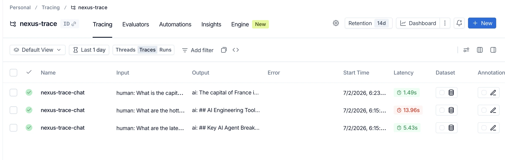

# Nexus Trace

[](https://github.com/arifdewiuae/nexus-trace/actions/workflows/ci.yml)

A streaming AI agent with a live tool-call trace panel. Ask a question, watch the reasoning steps and web searches unfold in real time — then read the answer as it arrives token by token.

Built as a portfolio project to demonstrate production-grade AI engineering: LangGraph ReAct loop, SSE streaming, rate limiting, session management, swappable LLM providers, LangSmith tracing, and a polished React UI.


📖 **[How it works under the hood →](https://nexus-trace.vercel.app/how-it-works.html)** — a rendered visual deep-dive into the layers, the SSE protocol, the ReAct loop, and the numbers behind it all (served at `/how-it-works.html` from `public/`).

---

## Features

- **Live trace panel** — every model reasoning step and tool call appears as it happens, with duration timers and inline query previews
- **Token-by-token streaming** — assistant responses stream via SSE; a cursor blinks as text arrives
- **Web search** — Tavily-powered search runs inside the agent loop; results feed back into the next reasoning step
- **Swappable LLM provider** — switch the whole agent between Fireworks (open models) and Anthropic Claude right from the Settings panel (or via env default) — no code changes, adapter-swap architecture
- **Cost & latency, surfaced** — every run reports TTFT, total latency, per-step durations, token usage, and estimated USD cost, live in the trace panel
- **LangSmith tracing** — set the LangSmith env vars and every run is traced; a dev-only "View in LangSmith" link jumps straight to the run
- **Two-mode keys** — demo mode uses server-side keys; users can supply their own LLM + Tavily keys for higher rate limits
- **Rate limiting** — sliding-window limits per session (Upstash Redis in prod, in-memory fallback in dev)
- **Context management** — history is capped to the last 10 turns and long messages are truncated before hitting the LLM
- **Connection banner** — a fixed banner appears immediately when the network drops
- **Device-aware rendering** — tables on desktop, structured bullet lists on mobile
- **Distinct persona** — Nexus has its own voice: confident, direct, and friendly without being stiff

---

## Tech stack

| Layer | Technology |
|---|---|
| Framework | Next.js 16 (App Router) |
| Language | TypeScript |
| Styling | Tailwind CSS v4 + shadcn/ui |
| AI orchestration | LangGraph.js (ReAct agent) |
| LLM | Fireworks.ai (MiniMax M2.7, default) **or** Anthropic Claude (`claude-sonnet-4-6`) — selectable via `LLM_PROVIDER` |
| Web search | Tavily Search API |
| Streaming | Server-Sent Events (SSE) |
| Observability | LangSmith (auto-traced LangGraph runs) |
| Rate limiting | Upstash Redis (`@upstash/ratelimit`) |
| Animations | Framer Motion |
| Tests | Vitest + happy-dom (unit), Playwright (E2E, CI-gated) |

---

## Architecture

```
ChatInput (user types)
  → useAgentStream.sendMessage()
    → POST /api/chat                    route handler
      → runAgentStream()                async generator (LangGraph)
        → createAgent() graph           ReAct loop
          → Fireworks.ai (LLM)
          → web_search tool → Tavily
        yields StreamEvent SSE strings
      → generatorToStream()             wrapped as ReadableStream
    → parseSSE()                        yields StreamEvent objects
    → applyEvent()                      updates React state
  → MessageList re-renders tokens live
  → TracePanel re-renders steps live
```

**Layers — strict, no cross-layer shortcuts:**

```
lib/agent/        AI layer     LangGraph graph, tools, system prompt
lib/api/          API layer    HTTP client (fetch wrappers)
lib/streaming/    Protocol     SSE encode/decode, StreamEvent types
lib/types.ts      Domain       Message, TraceStep, shared const objects
lib/config.ts     Config       All numeric + string constants
components/       UI layer     React components (1 file = 1 component)
hooks/            UI layer     React hooks
app/              Entry points Next.js routes and layouts
```

---

## Quickstart

```bash
git clone https://github.com/arifdewiuae/nexus-trace.git
cd nexus-trace
pnpm install
cp .env.local.example .env.local
```

Edit `.env.local`:

```env
DEMO_KEYS_ENABLED=true
NEXT_PUBLIC_DEMO_KEYS_ENABLED=true
FIREWORKS_API_KEY=fw_...
TAVILY_API_KEY=tvly-...
```

```bash
pnpm dev
```

Open [http://localhost:3000](http://localhost:3000).

---

## Environment variables

| Variable | Required | Description |
|---|---|---|
| `LLM_PROVIDER` | No | Server default provider — `fireworks` or `anthropic` (UI `x-llm-provider` header overrides per request) |
| `NEXT_PUBLIC_LLM_PROVIDER` | No | Client's initial provider selection (should match `LLM_PROVIDER`) |
| `FIREWORKS_API_KEY` | Fireworks + demo mode | LLM inference via Fireworks.ai |
| `ANTHROPIC_API_KEY` | Anthropic + demo mode | LLM inference via Anthropic Claude |
| `TAVILY_API_KEY` | When demo mode on | Web search via Tavily (both providers) |
| `OPENAI_API_KEY` | No | Content moderation via OpenAI's moderation endpoint (omit to rely on jailbreak-pattern checks only) |
| `DEMO_KEYS_ENABLED` | No | `true` to use server-side keys as fallback |
| `NEXT_PUBLIC_DEMO_KEYS_ENABLED` | No | Must match `DEMO_KEYS_ENABLED` |
| `FIREWORKS_MODEL` | No | Override Fireworks model (default: `minimax-m2p7`) |
| `FIREWORKS_BASE_URL` | No | Override the Fireworks API base URL (rarely needed) |
| `ANTHROPIC_MODEL` | No | Override Claude model (default: `claude-sonnet-4-6`) |
| `LANGSMITH_TRACING` | No | `true` to trace runs to LangSmith |
| `LANGSMITH_API_KEY` | For tracing | LangSmith API key |
| `LANGSMITH_PROJECT` | No | LangSmith project name (default project otherwise) |
| `LANGSMITH_ENDPOINT` | EU workspaces | LangSmith data-plane URL; EU workspaces must set `https://eu.api.smith.langchain.com` (US default otherwise) |
| `LANGSMITH_HIDE_INPUTS` | No | `true` to omit run inputs (prompts) from traces — PII safety |
| `LANGSMITH_HIDE_OUTPUTS` | No | `true` to omit run outputs (replies) from traces — PII safety |
| `NEXT_PUBLIC_LANGSMITH_PROJECT_URL` | No | Base URL for the dev-only "View in LangSmith" link |
| `UPSTASH_REDIS_REST_URL` | No | Redis URL for persistent rate limiting |
| `UPSTASH_REDIS_REST_TOKEN` | No | Redis token for persistent rate limiting |

Without Upstash, rate limiting falls back to an in-memory store that resets on server restart — fine for dev, not for production.

---

## Commands

```bash
pnpm dev             # start dev server on :3000
pnpm build           # production build (also runs tsc)
pnpm lint            # ESLint
pnpm lint:fix        # ESLint with --fix
pnpm format          # Prettier (sorts Tailwind classes)
pnpm test            # Vitest unit tests
pnpm test:e2e        # Playwright E2E (builds + serves the app, then runs the golden path)
pnpm exec tsc --noEmit  # type-check without emit
```

---

## Rate limits

| Key type | Limit |
|---|---|
| Demo (server keys) | 20 requests / hour |
| Own keys | 100 requests / hour |

Limits are per session (HTTP-only cookie, 1-year expiry). Upstash Redis is used in production; falls back to in-memory Map in development.

---

## Provider selection (Fireworks or Claude)

The agent's LLM is a runtime **adapter-swap**: the same ReAct loop runs on either provider with no
code changes. It's switchable two ways:

- **Per user, in the UI** — open **Settings → Agent provider** and pick Fireworks or Claude. The
  choice is stored in the browser and sent with each request as an `x-llm-provider` header.
- **Deploy default, via env** — `LLM_PROVIDER` (server) sets the fallback when the UI hasn't chosen;
  `NEXT_PUBLIC_LLM_PROVIDER` is the client's initial selection.

```env
# Open models via Fireworks (default)
LLM_PROVIDER=fireworks
NEXT_PUBLIC_LLM_PROVIDER=fireworks
FIREWORKS_API_KEY=fw_...

# — or — Anthropic Claude
LLM_PROVIDER=anthropic
NEXT_PUBLIC_LLM_PROVIDER=anthropic
ANTHROPIC_API_KEY=sk-ant-...
```

Both providers plug into the same LangGraph `createAgent` / `streamEvents` pipeline
(`src/lib/agent/graph.ts`): Fireworks via `@langchain/openai` `ChatOpenAI` pointed at its
OpenAI-compatible endpoint, Claude via `@langchain/anthropic` `ChatAnthropic`. The server resolves the
provider per request (`x-llm-provider` header → `LLM_PROVIDER` env), then threads it into
`runAgentStream`. Tavily web search is provider-independent, and the Settings modal shows the matching
key field so bring-your-own-key works for either.

> The default Claude model is `claude-sonnet-4-6` because it accepts the shared agent `temperature`.
> `claude-sonnet-5` rejects non-default sampling params — switch to it only if you also drop `AGENT_TEMPERATURE`.

---

## Cost & latency observability

Every run is fully instrumented end to end — no extra services required. It's computed server-side in
`src/lib/agent/graph.ts` and rendered live in the trace panel:

| Metric | Where it's measured | Where it shows |
|---|---|---|
| **TTFT** (time to first token) | first `token_delta` vs. run start | trace panel header |
| **Total latency** | `DONE` event (`latencyMs`) | trace panel header |
| **Per-step duration** | each `model_end` / `tool_result` (`durationMs`) | each trace step card |
| **Token usage** (in / out / total) | `usage_metadata` on `model_end` (`extractTokenUsage`) | `SessionStats` footer |
| **Estimated cost (USD)** | tokens × per-1M rates (`MODEL_PRICING` in `src/lib/config.ts`) | `SessionStats` footer |

Cost uses per-provider pricing tables in `src/lib/config.ts` (Fireworks + Claude), so the estimate is
correct whichever provider is active. Session totals persist across the tab session
(`STORAGE_KEY_SESSION_USAGE`).

---

## LangSmith tracing

The agent uses LangChain, so LangSmith tracing needs **no code** — set the env vars and every run is
traced automatically:

```env
LANGSMITH_TRACING=true
LANGSMITH_API_KEY=lsv2_...
LANGSMITH_PROJECT=nexus-trace
```

Each run is tagged with the active provider + model and named `nexus-trace-chat` for easy filtering.
In development, once a run finishes the trace panel shows a **"View in LangSmith"** link (set
`NEXT_PUBLIC_LANGSMITH_PROJECT_URL` to your project URL for a per-run deep link).

- **EU workspaces** (`eu.smith.langchain.com`): also set `LANGSMITH_ENDPOINT=https://eu.api.smith.langchain.com`, or traces silently fail to upload (the SDK defaults to the US data plane).
- **Privacy**: LangSmith stores full run inputs and outputs by default. To trace structure/latency/tokens without persisting content, set `LANGSMITH_HIDE_INPUTS=true` and `LANGSMITH_HIDE_OUTPUTS=true`.



---

## Testing

```bash
pnpm test        # Vitest unit tests (pure helpers, reducer, hooks) — happy-dom
pnpm test:e2e    # Playwright E2E golden path
```

The E2E suite (`e2e/chat.spec.ts`) drives the real UI against a production build and mocks `/api/chat`
with canned SSE frames — exercising the full **send → tool-call → stream → replay** flow with no LLM or
network calls. CI (`.github/workflows/ci.yml`) runs lint + type-check + unit tests in one job and the
Playwright suite as a separate gated job.

---

## License

[MIT](LICENSE) © arifdewiuae
